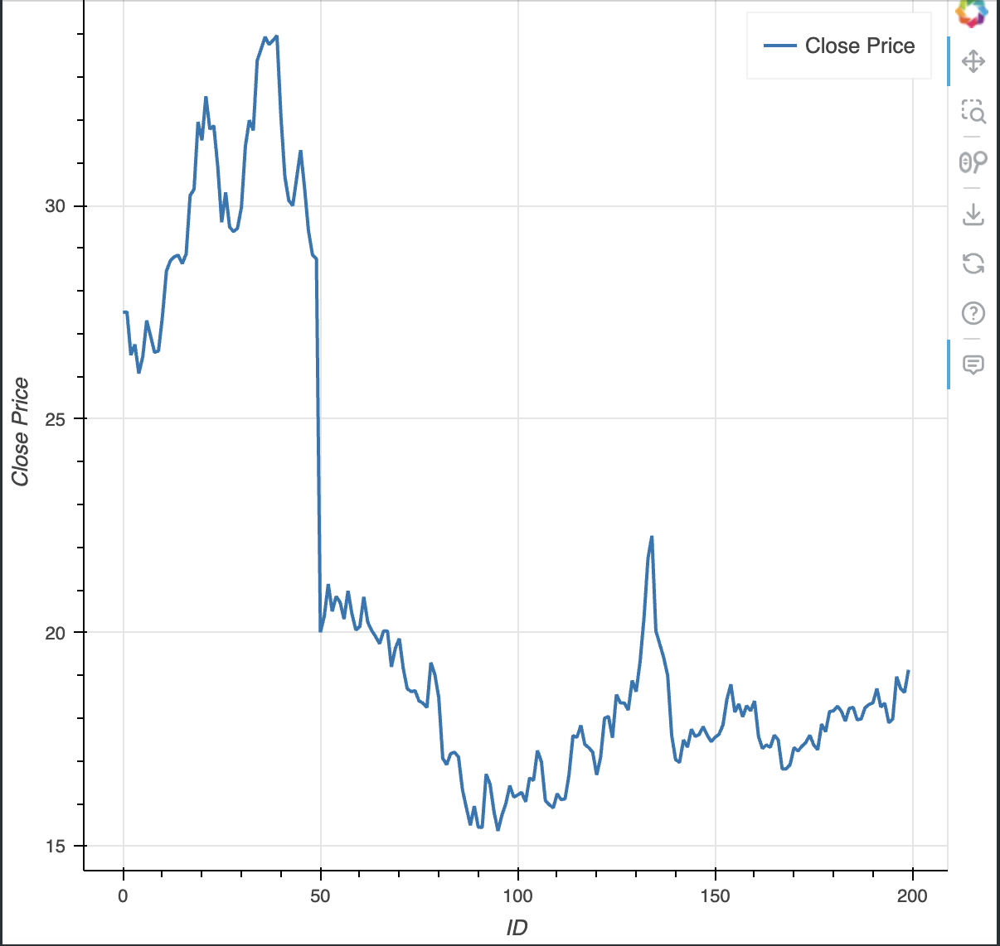

# mla
machine learning using Shanghai Stock Indexes

## Liner Prediction
```python
from sklearn.linear_model import LinearRegression

# 初始化模型
model = LinearRegression()

# 训练模型
model.fit(X_train, y_train)

# 评估模型
score = model.score(X_test, y_test)
print(f"Model R^2 Score: {score}")  
```

